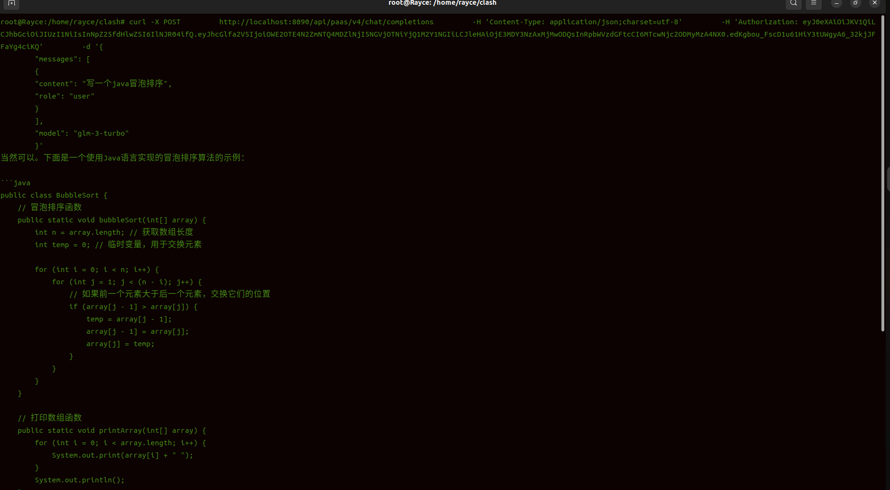

# ChatGLM接口实现

### curl测试
#### 测试手法
1. 运行ChatGLMAIServiceController的main函数， 获取Authorization的token
2. 将token配置在curl中
```shell

  curl -X POST \
        http://localhost:8090/api/paas/v4/chat/completions \
        -H 'Content-Type: application/json;charset=utf-8' \
        -H 'Authorization: 你的token' \
        -d '{
        "messages": [
        {
        "content": "写一个java冒泡排序",
        "role": "user"
        }
        ],
        "model": "glm-3-turbo"
        }'
    
```

#### 结果



# 说明
本项目所使用的ChatGLM的SDK是小傅哥开发的SDK， 本人仅作学习使用
小傅哥项目地址： https://github.com/fuzhengwei/chatglm-sdk-java